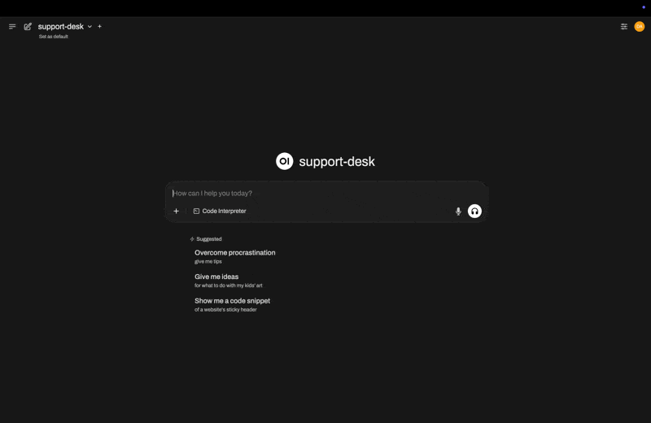

# Agentic Workbench - LangGraph


## Overview

Run agentic workflows locally using LangGraph and Python. Part of the Agentic Workbench series.

> 🔗 Soon also available in [TypeScript with Mastra](https://github.com/dextersjab/agentic-workbench-mastra)

Build and experiment with agentic workflows with ease.

Connect to the popular open-source frontend [Open WebUI](https://openwebui.com/) for a ChatGPT-like experience.

The workflows in this project are based on winning solutions to real enterprise challenges.

Feel free to take inspiration, modify and build your own!



## Project structure

```
agentic-workbench-langgraph/
├── docker-compose.yml            # Multi-service Docker setup
├── .env.example                  # Environment variables template
├── README.md
├── Makefile                      # Convenient development commands
├── backend/                      # FastAPI backend service
│   ├── Dockerfile
│   ├── main.py                   # API server entrypoint
│   ├── requirements.txt
│   ├── src/
│   │   ├── core/                 # Shared API and LLM client code  
│   │   └── workflows/
│   │       ├── support_desk/     # IT support desk workflow
│   │       └── fs_agent/         # File system agent workflow
│   ├── langgraph-app/
│   └── logs/
└── frontend/                     # OpenWebUI frontend service
    └── Dockerfile
```

## Example workflows

- **[Support Desk](backend/src/workflows/support_desk/README.md)** - IT support desk agentic chatbot that answers queries and raises tickets
- **[FS Agent](backend/src/workflows/fs_agent/README.md)** - ReAct-based file system agent with planning, thinking loops, and human approval for risky operations

## Quick start

### Using Make commands (recommended)

1. **Clone and setup**:
   ```bash
   git clone https://github.com/dextersjab/agentic-workbench-langgraph
   cd agentic-workbench-langgraph
   cp .env.example .env
   ```

2. **Configure API keys** in `.env`:
   ```bash
   # Required for workflows
   OPENROUTER_API_KEY=your_openrouter_api_key_here # Required for all workflows
   ```

3. **Start both services**:
   ```bash
   make start
   ```

4. **Monitor startup progress**:
   ```bash
   make logs
   ```
   
   Open WebUI takes time to fully initialize. Watch for the "Waiting for application startup." line to change, indicating the frontend is ready.

5. **Access the application**:
   - **OpenWebUI Interface**: http://localhost:3000
   - **API Documentation**: http://localhost:8000/docs
   - **API Health Check**: http://localhost:8000/v1/

The agentic workflows will appear in the OpenWebUI model selector dropdown.


### Manual setup

If you prefer to run services individually:

1. **Backend API**:
   ```bash
   cd backend
   pip install -r requirements.txt
   python main.py
   ```

2. **Frontend (separate terminal)**:
   ```bash
   docker run -d -p 3000:8080 \
     -e OPENAI_API_BASE_URL=http://host.docker.internal:8000/v1 \
     -e OPENROUTER_API_KEY=dummy-key-not-used \
     ghcr.io/open-webui/open-webui:main
   ```

## Features

- **🔄 Stateful Conversations**: Workflow state persists across messages using OpenWebUI chat IDs
- **🔀 Multi-step Workflows**: Complex business logic with LangGraph workflows
- **⚡ Real-time Streaming**: Server-sent events for responsive chat experience
- **🛠️ Human-in-the-Loop**: Interactive workflows that can ask for clarification
- **🐳 Docker Ready**: One-command deployment with Docker Compose
- **📊 OpenAI Compatible**: Works with any OpenAI-compatible client
- **🔍 Debug Friendly**: Comprehensive logging and health checks

## Configuration

### Environment Variables

See the Quick Start section above for `.env` setup instructions. Available options:

```bash
# Required API Keys (depending on workflow)
OPENROUTER_API_KEY=your_openrouter_api_key_here # Required for all workflows

# Optional
BACKEND_PORT=8000
FRONTEND_PORT=3000
DEBUG=false
LOG_LEVEL=info
```

### OpenWebUI Configuration

The frontend service is pre-configured with optimal settings:
- Connects automatically to the backend API
- Disables unnecessary features (tags, titles, follow-ups)
- Workflows available via model selector dropdown

## Adding new workflows

To add a new workflow to the project:

1. Create a new directory under `backend/src/workflows/` using underscores (e.g., `my_workflow/`)
2. Add a `workflow.py` file with a `create_workflow()` function that returns your LangGraph workflow
3. Add a model entry to the registry with the corresponding model ID using dashes (e.g., `"my-workflow"`)

The system will automatically discover and load workflows based on this convention:
- Model ID `"my-workflow"` maps to directory `backend/src/workflows/my_workflow/`
- Each workflow must have `workflow.py` with `create_workflow()` function

## Development

### Service architecture

- **Backend**: FastAPI server providing OpenAI-compatible endpoints
- **Frontend**: OpenWebUI providing ChatGPT-like interface
- **Communication**: HTTP requests with proper CORS handling
- **State Management**: LangGraph checkpointer with thread-based persistence

### Health checks

The backend includes health checks accessible at:
- `GET /v1/` - API information and status
- `GET /v1/models` - Available workflow models

### Logs

Backend logs are available in `backend/logs/` directory and include:
- Request/response details
- Workflow execution steps
- Error traces and debugging info

## Troubleshooting

### Common issues

1. **Backend fails to start**: Check your API keys in `.env`
2. **Frontend can't connect**: Verify backend is running on port 8000
3. **Workflows not appearing**: Check backend logs for model registration errors
4. **"Unknown workflow" errors**: 
   - Ensure required API keys are set (see Quick Start step 2)
   - Restart services after updating environment variables: `make stop && make start`

### Health check commands

```bash
# Check if backend is responding
curl http://localhost:8000/v1/

# List available models
curl http://localhost:8000/v1/models

# Check service status
make health-check

# View logs
make logs
make logs-backend
make logs-frontend
```

## 🔗 Framework implementations

This is the **LangGraph (Python)** implementation. 

Also available:
- [Mastra (TypeScript)](https://github.com/dextersjab/agentic-workbench-mastra) - Same workflows in TypeScript using Mastra framework

Both implementations provide the same workflows with framework-specific patterns.

## Contributing

1. Fork the repository
2. Create a feature branch
3. Add your workflow following the existing patterns
4. Test with Docker Compose setup
5. Submit a pull request

For detailed workflow development, see the README files in each workflow directory:
- [Support Desk Workflow](backend/src/workflows/support_desk/README.md)
- [FS Agent Workflow](backend/src/workflows/fs_agent/README.md)

## License

See [LICENCE.txt](LICENCE.txt) for details.