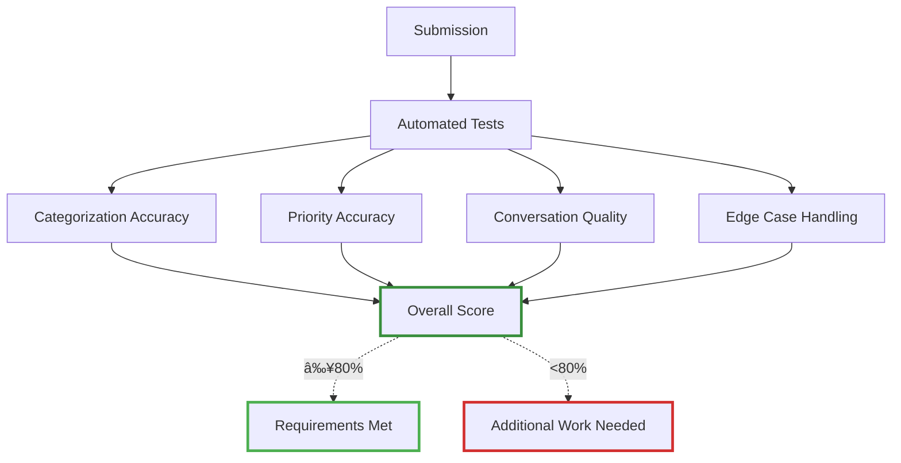

# 🎯 HelpHub — IT Support Chatbot Case Study

A comprehensive case study for building realistic AI agents using LangGraph.

Project description:

> *"As CTO of GlobalTech Solutions, a Microsoft-centric enterprise with 15,000+ employees across 40 countries, our centralized IT team faces a constant challenge: providing 24/7 multilingual support to staff in every timezone. We needed an intelligent first-line agent that could handle the complexity of real IT issues while seamlessly integrating with our existing ServiceHub ITSM platform and Teams-based workflow. HelpHub represents our vision for scalable, intelligent IT support that never sleeps."*  
> **– Sarah Chen, CTO, GlobalTech Solutions** (↠fictional project sponsor)

## 🚀 Setup

This repository is a template for building and running your agent with an API that's compatible with the OpenAI Chat Completions API and Open WebUI interface.

Follow the steps below to get started.

1. Clone this repo

```shell
git clone https://github.com/dextersjab/agentic-course-case-study-0
cd agentic-course-case-study-0
```

2. Set up using `uv` (recommended)

On Mac:
```shell
uv venv
source .venv/bin/activate
```

On Windows:
```shell
uv venv
.venv\Scripts\activate
```

3. Install dependencies:

```shell
uv pip install -r requirements.txt
```

4. Start the HelpHub API:
```
uvicorn src.core.api:app --reload --port 8000
```

Open [http://localhost:8000/docs](http://localhost:8000/docs) for Swagger UI.

## 🌠Open WebUI Integration

The Agent API is fully compatible with [Open WebUI](https://openwebui.com/), a popular web interface for LLM-based chat apps.

To interact with your chatbot using Open WebUI:

### 1. Follow the above steps to start the HelpHub API

### 2. Configure Open WebUI

Option 1: Docker container

```shell
docker run -d -p 3000:8080 \
  -e OPENAI_API_BASE_URL=http://localhost:8000/v1 \
  -e OPENAI_API_KEY=not-needed \
  --name open-webui ghcr.io/open-webui/open-webui:main
```

Option 2: Install locally
```shell
uv pip install open-webui
open-webui serve --port 3000
```

Note: Open WebUI takes a few minutes to finish building. If running with Docker, you can monitor progress using `docker logs -f open-webui`.

See the [Open WebUI](https://github.com/open-webui/open-webui) repository for more details.

### 3. Add the HelpHub agent as a "model"
1. Open [http://localhost:3000](http://localhost:3000)
2. Go to Settings (in bottom right menu) → Connections
3. Add OpenAI API connection:
   - **API Base URL**: `http://localhost:8000/`
   - **API Key**: `not-needed` (placeholder)
4. Your HelpHub models will appear in the model selector

### 4. Chat with HelpHub
Select "helphub-v1" from the model dropdown and start chatting!

Initially, a chatbot built on this agentic workflow simply ask a clarifying question in response to your prompts.


Once you've completed this exercise, your chatbot will:
- ask clarifying questions for vague issues
- categorise users' IT support requests
- assess priority based on business impact
- route to appropriate support teams
- create ServiceHub tickets automatically

Try these example conversation starters:
- "My laptop won't turn on"
- "I can't access my email"
- "The wifi is really slow today"
- "I need a software license for Adobe"

## 🧪 Testing

```bash
pytest -q
```

---

# 📋 Product Requirements Document (PRD)

## 1. Executive Summary

**HelpHub** is an AI-powered IT support chatbot designed to automatically **categorize**, **prioritize**, and **route** support tickets while intelligently leveraging knowledge base resources when appropriate. This system serves as a comprehensive case study for building enterprise-grade AI agents using **LangGraph** that handle real-world IT support scenarios through intelligent multi-turn conversations.

### Key Objectives
- **Automate** ticket categorization and routing through conversational AI
- **Reduce** mean time to resolution (MTTR) via intelligent question loops
- **Improve** first-contact resolution rates with intelligent KB utilization
- **Handle** interruptions, topic changes, and escalation requests seamlessly

## 2. LangGraph Workflow


### 2.1 Simplified Workflow Logic

**Linear Workflow**: The agent processes each support request through a sequence of LLM-powered nodes:

1. **clarify_issue**: LLM determines if user input is clear enough or asks clarifying questions
2. **categorize_issue**: LLM categorizes the issue (hardware, software, network, access, billing)  
3. **assess_priority**: LLM evaluates urgency and business impact (P1/P2/P3)
4. **route_ticket**: LLM determines appropriate support team assignment
5. **create_ticket**: Makes API call to ServiceHub to create the support ticket

Each node represents a distinct step where the LLM processes information and makes decisions, with the workflow progressing linearly from start to end.

## 4. Realistic Ticket Scenarios

### 4.1 Vague Descriptions
| User Input | Agent Response | Expected Outcome |
|------------|---------------|------------------|
| "Everything is broken" | "I'm sorry to hear that. Can you tell me what specifically isn't working?" | Question loop to clarify |
| "My computer is slow" | "When did you first notice the slowness? Is it when starting up, opening programs, or browsing?" | Categorize as Performance issue |
| "I can't work" | "What's preventing you from working? Is it a login issue, application problem, or hardware failure?" | Multiple clarifying questions |

### 4.2 Multi-Category Issues
| Scenario | Categorization Challenge | Expected Handling |
|----------|------------------------|-------------------|
| "Can't login to email on new laptop" | Access + Hardware setup | Decompose into two tickets |
| "VPN won't connect and now Teams is down" | Network + Software | Prioritize VPN (likely root cause) |
| "Printer offline and need software installed" | Hardware + Software | Handle separately, software can wait |

### 4.3 Interruption Scenarios
| Original Issue | Interruption | Expected Behavior |
|---------------|-------------|------------------|
| Password reset request | "Actually, I need to join a meeting first" | Save context, prioritize meeting access |
| Hardware repair | "Wait, is the help desk open now?" | Answer query, return to hardware issue |
| Software installation | "This is urgent, my presentation is in 10 minutes" | Escalate priority, expedite handling |

## 5. Technical Components

### 5.1 Categorization Engine

The system uses a multi-stage NLP pipeline to categorize incoming tickets:

| Category | Common Phrases | Confidence Threshold |
|----------|---------------|---------------------|
| Hardware | "laptop", "battery", "printer", "black screen", "won't turn on" | 0.75 |
| Software | "password", "login", "application", "install", "error message" | 0.80 |
| Network | "wifi", "vpn", "connection", "internet", "can't connect" | 0.70 |
| Access | "permissions", "account", "locked out", "can't access", "reset" | 0.85 |
| Billing | "invoice", "cost", "license", "payment", "subscription" | 0.65 |

### 5.2 Priority Assessment Logic


### 5.3 Built-in Constraints


## 6. Knowledge Base Integration

The agent receives relevant KB articles as JSON context. Sample KB data structure:

```json
{
  "articles": [
    {
      "id": "password-reset",
      "question": "How do I reset my password?",
      "answer": "Use the self-service portal at company.com/reset..."
    },
    {
      "id": "email-slow", 
      "question": "Email is slow",
      "answer": "Try clearing cache, check network connection..."
    }
  ]
}
```

The LLM can reference this data to provide instant answers for common questions.

## 7. User Journey Examples

### 7.1 Success Journey - Hardware Issue
```
User: "My laptop won't start"
Agent: "I'll help you with that. When you press the power button, what happens?"
User: "Nothing at all, no lights or sounds"
Agent: "Are you using the power adapter or just battery?"
User: "I have it plugged in"
Agent: "I've created ticket #12345 for a hardware repair. This appears to be a power supply issue. A technician will contact you within 2 hours."
```

### 7.2 KB Data Usage Journey
```
User: "How do I reset my password?"
Agent: "I can help with that! You can use our self-service portal at company.com/reset. If your account is locked, you'll need to call the service desk at ext. 4357. Would you like me to walk you through the self-service process?"
User: "Yes please"
Agent: "Great! First, go to company.com/reset and enter your username..."
```

### 7.3 Complex Journey - Multiple Issues  
```
User: "I can't log into my email and my new laptop setup isn't working"
Agent: "I'll help you with both issues. Let's start with your email login - what error do you see?"
User: "It says invalid credentials"
Agent: "I'll create a password reset ticket for you. While that's processing, what's not working with your laptop setup?"
User: "Actually, the email thing is more urgent, I have a client call in 5 minutes"
Agent: "Understood. I'll prioritize the email issue and create an urgent ticket. Try the password reset link I'm sending now."
```

### 7.4 Escalation Journey
```
User: "The server room is flooding!"
Agent: "This is a critical emergency. I'm creating a P1 ticket and immediately notifying the facilities team. Are you in a safe location?"
User: "Yes, I'm out of the room"
Agent: "Ticket #99999 created. Emergency response team has been alerted. Please stay clear of the area."
```

## 8. ServiceHub Integration

### 8.1 Mock Enterprise System

ServiceHub simulates a realistic ITSM platform with:

- **Ticket Management**: Creation, updates, status tracking
- **Assignment Groups**: L1-Hardware, L1-Software, L2-Network, etc.
- **SLA Tracking**: Automatic escalation based on priority
- **Reporting**: Metrics dashboard and KPI tracking


### 8.2 ServiceHub Integration

ServiceHub integration is handled internally by the **create_ticket node** in the LangGraph workflow. This node:

- Creates tickets in the mock ITSM platform
- Assigns tickets to appropriate queues based on routing decisions
- Generates ticket IDs and tracking information
- Provides users with ticket details and next steps
- Handles SLA calculations and follow-up procedures

**TODO for participants**: Implement the ServiceHub API client within the `create_ticket()` function to integrate with your organization's actual ITSM platform.

## 9. Evaluation Criteria

### 9.1 Automated Assessment

**Categorization Accuracy Score**: `(Correct Category + Correct Priority) / Total Predictions * 100`

| Component | Weight | Measurement |
|-----------|---------|-------------|
| Category Accuracy | 40% | Hardware/Software/Network/Access/Billing |
| Priority Accuracy | 30% | P1/P2/P3 assignment |
| Conversation Quality | 20% | Multi-turn handling, context retention |
| Edge Case Handling | 10% | Interruptions, topic changes, escalations |

### 9.2 Test Dataset Structure

```csv
ticket_id,description,user_context,expected_category,expected_priority,conversation_turns,has_interruption
1,"My laptop battery dies in 5 minutes","Remote worker, urgent project",hardware,P2,2,false
2,"Can't access shared drive, presentation in 1 hour","Manager, time pressure",access,P1,3,true
3,"Email is slow, not urgent","Regular user, no time pressure",software,P3,1,false
```

### 9.3 Multi-Turn Conversation Evaluation

Test scenarios evaluate:
- **Context Retention**: Agent remembers previous conversation details
- **Clarification Quality**: Questions are relevant and specific
- **Interruption Handling**: Graceful context switching
- **Topic Management**: Ability to juggle multiple issues

## 10. Technology Stack

### 10.1 Core Technologies

| Component | Technology | Purpose |
|-----------|------------|---------|
| Agent Framework | LangGraph | Workflow orchestration |
| LLM Provider | OpenRouter (GPT-4.1-mini, DeepSeek R1) | Natural language processing |
| API Framework | FastAPI | OpenAI-compatible API |
| Testing | pytest | Automated evaluation |

### 10.2 LangGraph Structure

```python
# Actual project structure for LangGraph workflow
src/workflows/helphub/
├── workflow.py       # Main LangGraph workflow definition
├── state.py          # Workflow state management (TypedDict)
├── nodes/            # Individual workflow nodes
│   ├── clarify_issue.py      # Clarification node (IMPLEMENTED)
│   ├── categorise_issue.py   # Categorization node (TODO)
│   ├── prioritise_issue.py   # Priority assessment node (TODO)
│   ├── triage_issue.py       # Triage/routing node (TODO)
│   └── create_ticket.py      # Ticket creation node (TODO)
└── prompts/          # LLM prompts for each node
    ├── clarification_prompt.py
    ├── categorization_prompt.py
    ├── priority_prompt.py
    ├── routing_prompt.py
    └── servicehub_prompt.py
```

### 10.3 Environment Setup

```bash
# Required environment variables
OPENROUTER_API_KEY=your_key_here
OPENAI_API_KEY=your_key_here  # Optional fallback
SERVICEHUB_BASE_URL=http://localhost:8000
```

## 11. Success Metrics & KPIs

### 11.1 Participant Success Metrics

| Metric | Target | Measurement |
|--------|---------|-------------|
| Categorization Accuracy | ≥85% | Automated evaluation |
| Priority Accuracy | ≥80% | Automated evaluation |
| Multi-turn Conversation Score | ≥75% | Conversation quality rubric |
| Edge Case Handling | ≥70% | Interruption/topic change scenarios |

### 11.2 Assessment Flow



## 12. Project Structure

```
agentic-course-case-study-0/
├── src/
│   ├── core/
│   │   ├── api.py             # OpenAI-compatible API
│   │   ├── models.py          # Pydantic models
│   │   ├── streaming.py       # SSE utilities
│   │   └── llm_client.py      # LLM client
│   └── workflows/
│       ├── registry.py        # Workflow registry
│       └── helphub/
│           ├── workflow.py    # LangGraph workflow
│           ├── state.py       # Workflow state
│           ├── nodes/         # Workflow nodes
│           │   ├── clarify_issue.py      # Clarification node (IMPLEMENTED)
│           │   ├── categorise_issue.py   # Categorization node (TODO)
│           │   ├── prioritise_issue.py   # Priority assessment node (TODO)
│           │   ├── triage_issue.py       # Triage/routing node (TODO)
│           │   └── create_ticket.py      # Ticket creation node (TODO)
│           └── prompts/       # LLM prompts
│               ├── clarification_prompt.py
│               ├── categorization_prompt.py
│               ├── priority_prompt.py
│               ├── routing_prompt.py
│               └── servicehub_prompt.py
├── data/
│   ├── tickets_train.csv      # Training scenarios
│   ├── tickets_test.csv       # Test scenarios
│   ├── conversations.json     # Multi-turn examples
│   └── seed_tickets.csv       # Additional test data
├── kb/
│   └── articles.json          # Knowledge base articles
├── tests/
│   └── grading.py             # Assessment utilities
├── docs/
│   └── prd.md                 # Product requirements document
├── main.py                    # API server entry point
├── requirements.txt           # Dependencies
└── README.md
```

## 13. Participant Learning Path

### 14.1 Prerequisites
- **Python Proficiency**: Comfortable with Python programming
- **Basic AI/ML Understanding**: Familiarity with LLMs and prompting
- **No LangGraph Experience Required**: Will be taught as part of the course

### 14.2 Learning Progression

1. **Week 1**: Understand the problem domain and existing codebase
2. **Week 2**: Implement basic LangGraph workflow with question loop
3. **Week 3**: Add conversation intelligence and edge case handling
4. **Week 4**: Optimize performance and complete evaluation

### 14.3 Success Criteria

Participants will demonstrate mastery by:
- Building a functional multi-turn conversation agent
- Achieving ≥80% accuracy on categorization and priority assessment
- Handling interruptions and topic changes gracefully
- Integrating with mock enterprise systems

## 14. API Reference

### 15.1 Core Endpoints

| Endpoint | Method | Purpose | Example Request |
|----------|---------|---------|-----------------|
| `/v1/models` | GET | List available models | N/A |
| `/v1/chat/completions` | POST | Chat completion (streaming & non-streaming) | `{"model": "helphub-v1", "messages": [{"role": "user", "content": "My laptop won't start"}], "stream": true}` |
| `/v1/` | GET | API information with HATEOAS links | N/A |
| `/docs` | GET | Interactive API documentation | N/A |

### 15.2 Response Formats

**Streaming Response (SSE)**:
```
data: {"id": "chatcmpl-abc123", "object": "chat.completion.chunk", "created": 1234567890, "model": "helphub-v1", "choices": [{"index": 0, "delta": {"role": "assistant", "content": "I'll help you with that laptop issue..."}, "finish_reason": null}]}

data: [DONE]
```

**Non-streaming Response**:
```json
{
  "id": "chatcmpl-abc123",
  "object": "chat.completion",
  "created": 1234567890,
  "model": "helphub-v1",
  "choices": [
    {
      "index": 0,
      "message": {
        "role": "assistant",
        "content": "I'll help you with that laptop issue..."
      },
      "finish_reason": "stop"
    }
  ],
  "usage": {
    "prompt_tokens": 25,
    "completion_tokens": 100,
    "total_tokens": 125
  }
}
```

---

## 🧪 Testing

```bash
pytest -q
```

For questions or feedback, please open an issue on GitHub.
