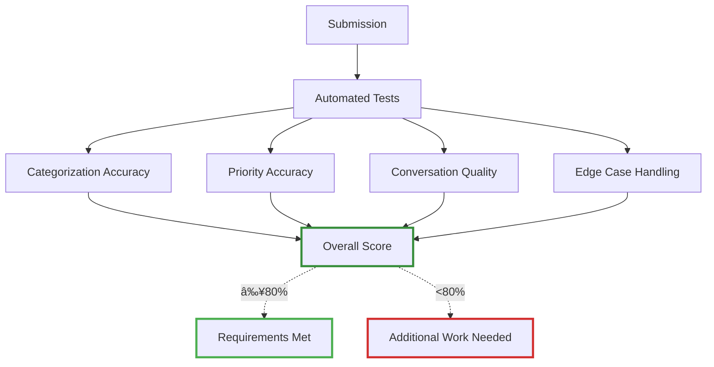

# 🎯 HelpHub – IT Support Chatbot Case Study

> **Enterprise Agent Development Course**  
> A comprehensive case study for building realistic AI agents using LangGraph in IT support environments

## 🚀 Quick Start

```bash
# Clone and setup
git clone https://github.com/dextersjab/agentic-course-case-study-0
cd agentic-course-case-study-0
# Setup with uv (recommended)

uv venv
source .venv/bin/activate

# On Windows: .venv\Scripts\activate

uv pip install -r requirements.txt

# Alternative: traditional pip
# pip install -r requirements.txt

# Start the HelpHub API
uvicorn src.core.api:app --reload
```

Open [http://localhost:8000/docs](http://localhost:8000/docs) for Swagger UI.

## 🌠Open WebUI Integration

The API is fully compatible with [Open WebUI](https://openwebui.com/) for a chat interface:

### 1. Start the HelpHub API
```bash
# Start the API server
uvicorn src.core.api:app --host 0.0.0.0 --port 8000 --reload
```

### 2. Configure Open WebUI
```bash
# Option 1: Docker (recommended)
docker run -d -p 3000:8080 \
  -e OPENAI_API_BASE_URL=http://localhost:8000/v1 \
  -e OPENAI_API_KEY=not-needed \
  --name open-webui ghcr.io/open-webui/open-webui:main

# Option 2: Install locally
pip install open-webui
open-webui serve --port 3000
```

### 3. Add HelpHub Model
1. Open [http://localhost:3000](http://localhost:3000)
2. Go to Settings → Connections
3. Add OpenAI API connection:
   - **API Base URL**: `http://localhost:8000/v1`
   - **API Key**: `not-needed` (placeholder)
4. The HelpHub models will appear in the model selector

### 4. Chat with HelpHub
Select "helphub-v1" from the model dropdown and start chatting! The agent will:
- Ask clarifying questions for vague issues
- Categorize your IT support request
- Assess priority based on business impact
- Route to appropriate support teams
- Create ServiceHub tickets automatically

Try these example conversations:
- "My laptop won't turn on"
- "I can't access my email"
- "The wifi is really slow today"
- "I need a software license for Adobe"

## 🧪 Testing

```bash
pytest -q
```

---

# 📋 Product Requirements Document (PRD)

## 1. Executive Summary

**HelpHub** is an AI-powered IT support chatbot designed to automatically **categorize**, **prioritize**, and **route** support tickets while intelligently leveraging knowledge base resources when appropriate. This system serves as a comprehensive case study for building enterprise-grade AI agents using **LangGraph** that handle real-world IT support scenarios through intelligent multi-turn conversations.

### Key Objectives
- **Automate** ticket categorization and routing through conversational AI
- **Reduce** mean time to resolution (MTTR) via intelligent question loops
- **Improve** first-contact resolution rates with intelligent KB utilization
- **Handle** interruptions, topic changes, and escalation requests seamlessly

## 2. LangGraph Workflow


### 2.1 Simplified Workflow Logic

**Single Issue Focus**: The workflow only handles one issue at a time and discards non-urgent requests:

1. **Clarification**: LLM determines if user input is clear enough to proceed
2. **Categorization**: LLM categorizes the issue (hardware, software, network, access, billing)  
3. **Priority Assessment**: LLM evaluates urgency and business impact
4. **Urgency Filter**: Only P1 (Critical) and P2 (High) priority issues proceed
5. **Routing**: LLM determines appropriate support team assignment
6. **ServiceHub Integration**: Create ticket for urgent issues only

**Non-urgent issues (P3)** are politely acknowledged but not processed further, keeping the agent focused on high-impact problems.

## 4. Realistic Ticket Scenarios

### 4.1 Vague Descriptions
| User Input | Agent Response | Expected Outcome |
|------------|---------------|------------------|
| "Everything is broken" | "I'm sorry to hear that. Can you tell me what specifically isn't working?" | Question loop to clarify |
| "My computer is slow" | "When did you first notice the slowness? Is it when starting up, opening programs, or browsing?" | Categorize as Performance issue |
| "I can't work" | "What's preventing you from working? Is it a login issue, application problem, or hardware failure?" | Multiple clarifying questions |

### 4.2 Multi-Category Issues
| Scenario | Categorization Challenge | Expected Handling |
|----------|------------------------|-------------------|
| "Can't login to email on new laptop" | Access + Hardware setup | Decompose into two tickets |
| "VPN won't connect and now Teams is down" | Network + Software | Prioritize VPN (likely root cause) |
| "Printer offline and need software installed" | Hardware + Software | Handle separately, software can wait |

### 4.3 Interruption Scenarios
| Original Issue | Interruption | Expected Behavior |
|---------------|-------------|------------------|
| Password reset request | "Actually, I need to join a meeting first" | Save context, prioritize meeting access |
| Hardware repair | "Wait, is the help desk open now?" | Answer query, return to hardware issue |
| Software installation | "This is urgent, my presentation is in 10 minutes" | Escalate priority, expedite handling |

## 5. Technical Components

### 5.1 Categorization Engine

The system uses a multi-stage NLP pipeline to categorize incoming tickets:

| Category | Common Phrases | Confidence Threshold |
|----------|---------------|---------------------|
| Hardware | "laptop", "battery", "printer", "black screen", "won't turn on" | 0.75 |
| Software | "password", "login", "application", "install", "error message" | 0.80 |
| Network | "wifi", "vpn", "connection", "internet", "can't connect" | 0.70 |
| Access | "permissions", "account", "locked out", "can't access", "reset" | 0.85 |
| Billing | "invoice", "cost", "license", "payment", "subscription" | 0.65 |

### 5.2 Priority Assessment Logic


### 5.3 Built-in Constraints


## 6. Knowledge Base Integration

The agent receives relevant KB articles as JSON context. Sample KB data structure:

```json
{
  "articles": [
    {
      "id": "password-reset",
      "question": "How do I reset my password?",
      "answer": "Use the self-service portal at company.com/reset..."
    },
    {
      "id": "email-slow", 
      "question": "Email is slow",
      "answer": "Try clearing cache, check network connection..."
    }
  ]
}
```

The LLM can reference this data to provide instant answers for common questions.

## 7. User Journey Examples

### 7.1 Success Journey - Hardware Issue
```
User: "My laptop won't start"
Agent: "I'll help you with that. When you press the power button, what happens?"
User: "Nothing at all, no lights or sounds"
Agent: "Are you using the power adapter or just battery?"
User: "I have it plugged in"
Agent: "I've created ticket #12345 for a hardware repair. This appears to be a power supply issue. A technician will contact you within 2 hours."
```

### 7.2 KB Data Usage Journey
```
User: "How do I reset my password?"
Agent: "I can help with that! You can use our self-service portal at company.com/reset. If your account is locked, you'll need to call the service desk at ext. 4357. Would you like me to walk you through the self-service process?"
User: "Yes please"
Agent: "Great! First, go to company.com/reset and enter your username..."
```

### 7.3 Complex Journey - Multiple Issues  
```
User: "I can't log into my email and my new laptop setup isn't working"
Agent: "I'll help you with both issues. Let's start with your email login - what error do you see?"
User: "It says invalid credentials"
Agent: "I'll create a password reset ticket for you. While that's processing, what's not working with your laptop setup?"
User: "Actually, the email thing is more urgent, I have a client call in 5 minutes"
Agent: "Understood. I'll prioritize the email issue and create an urgent ticket. Try the password reset link I'm sending now."
```

### 7.4 Escalation Journey
```
User: "The server room is flooding!"
Agent: "This is a critical emergency. I'm creating a P1 ticket and immediately notifying the facilities team. Are you in a safe location?"
User: "Yes, I'm out of the room"
Agent: "Ticket #99999 created. Emergency response team has been alerted. Please stay clear of the area."
```

## 8. ServiceHub Integration

### 8.1 Mock Enterprise System

ServiceHub simulates a realistic ITSM platform with:

- **Ticket Management**: Creation, updates, status tracking
- **Assignment Groups**: L1-Hardware, L1-Software, L2-Network, etc.
- **SLA Tracking**: Automatic escalation based on priority
- **Reporting**: Metrics dashboard and KPI tracking


### 8.2 API Integration Points

| Endpoint | Method | Purpose | Example |
|----------|---------|---------|---------|
| `/servicehub/incidents` | POST | Create new ticket | `{"category": "hardware", "priority": "P1"}` |
| `/servicehub/incidents/{id}` | GET | Retrieve ticket status | Returns ticket details |
| `/servicehub/incidents/{id}` | PUT | Update ticket | Add notes, change status |
| `/servicehub/users/{id}` | GET | Get user details | For assignment and notifications |

## 9. Evaluation Criteria

### 9.1 Automated Assessment

**Categorization Accuracy Score**: `(Correct Category + Correct Priority) / Total Predictions * 100`

| Component | Weight | Measurement |
|-----------|---------|-------------|
| Category Accuracy | 40% | Hardware/Software/Network/Access/Billing |
| Priority Accuracy | 30% | P1/P2/P3 assignment |
| Conversation Quality | 20% | Multi-turn handling, context retention |
| Edge Case Handling | 10% | Interruptions, topic changes, escalations |

### 9.2 Test Dataset Structure

```csv
ticket_id,description,user_context,expected_category,expected_priority,conversation_turns,has_interruption
1,"My laptop battery dies in 5 minutes","Remote worker, urgent project",hardware,P2,2,false
2,"Can't access shared drive, presentation in 1 hour","Manager, time pressure",access,P1,3,true
3,"Email is slow, not urgent","Regular user, no time pressure",software,P3,1,false
```

### 9.3 Multi-Turn Conversation Evaluation

Test scenarios evaluate:
- **Context Retention**: Agent remembers previous conversation details
- **Clarification Quality**: Questions are relevant and specific
- **Interruption Handling**: Graceful context switching
- **Topic Management**: Ability to juggle multiple issues

## 10. Technology Stack

### 10.1 Core Technologies

| Component | Technology | Purpose |
|-----------|------------|---------|
| Agent Framework | LangGraph | Workflow orchestration |
| LLM Provider | OpenRouter (GPT-4.1-mini) | Natural language processing |
| Alternative LLM | DeepSeek R1 | Cost-effective option |
| API Framework | FastAPI | Mock ServiceHub endpoints |
| Testing | pytest | Automated evaluation |

### 10.2 LangGraph Structure

```python
# Project structure following Gemini quickstart pattern
src/
├── graph.py          # Main workflow definition
├── nodes.py          # Individual workflow steps
├── state.py          # Conversation state management
├── tools.py          # ServiceHub integration tools
└── evaluator.py      # Assessment logic
```

### 10.3 Environment Setup

```bash
# Required environment variables
OPENROUTER_API_KEY=your_key_here
OPENAI_API_KEY=your_key_here  # Optional fallback
SERVICEHUB_BASE_URL=http://localhost:8000
```

## 11. Success Metrics & KPIs

### 11.1 Participant Success Metrics

| Metric | Target | Measurement |
|--------|---------|-------------|
| Categorization Accuracy | ≥85% | Automated evaluation |
| Priority Accuracy | ≥80% | Automated evaluation |
| Multi-turn Conversation Score | ≥75% | Conversation quality rubric |
| Edge Case Handling | ≥70% | Interruption/topic change scenarios |

### 11.2 Assessment Flow



## 12. Project Structure

```
agentic-course-case-study-0/
├── src/
│   ├── graph.py              # LangGraph workflow
│   ├── nodes.py              # Workflow nodes
│   ├── state.py              # Conversation state
│   ├── tools.py              # ServiceHub tools
│   └── evaluator.py          # Assessment logic
├── api/
│   ├── main.py               # FastAPI mock services
│   └── servicehub.py         # ServiceHub simulation
├── data/
│   ├── tickets_train.csv     # Training scenarios
│   ├── tickets_test.csv      # Test scenarios
│   └── conversations.json    # Multi-turn examples
├── kb/
│   └── articles.json         # Knowledge base articles
├── tests/
│   ├── test_categorization.py
│   ├── test_conversation.py
│   └── test_integration.py
├── docs/
│   └── course_guide.md       # Participant instructions
└── requirements.txt
```

## 13. Participant Learning Path

### 14.1 Prerequisites
- **Python Proficiency**: Comfortable with Python programming
- **Basic AI/ML Understanding**: Familiarity with LLMs and prompting
- **No LangGraph Experience Required**: Will be taught as part of the course

### 14.2 Learning Progression

1. **Week 1**: Understand the problem domain and existing codebase
2. **Week 2**: Implement basic LangGraph workflow with question loop
3. **Week 3**: Add conversation intelligence and edge case handling
4. **Week 4**: Optimize performance and complete evaluation

### 14.3 Success Criteria

Participants will demonstrate mastery by:
- Building a functional multi-turn conversation agent
- Achieving ≥80% accuracy on categorization and priority assessment
- Handling interruptions and topic changes gracefully
- Integrating with mock enterprise systems

## 14. API Reference

### 15.1 Core Endpoints

| Endpoint | Method | Purpose | Example Request |
|----------|---------|---------|-----------------|
| `/chat` | POST | Start conversation | `{"message": "My laptop won't start"}` |
| `/chat/continue` | POST | Continue conversation | `{"session_id": "123", "message": "No lights"}` |
| `/categorize` | POST | Categorize ticket | `{"description": "Email password reset"}` |
| `/prioritize` | POST | Assess priority | `{"description": "Server room flooding"}` |
| `/kb/search` | GET | Search knowledge base | `?query=password+reset` |

### 15.2 Response Formats

```json
{
  "session_id": "uuid",
  "response": "I'll help you with that laptop issue...",
  "needs_clarification": true,
  "suggested_questions": ["What happens when you press power?"],
  "category": "hardware",
  "priority": "P1",
  "confidence": 0.85
}
```

## 15. Common Issues & Solutions

### 16.1 Development Issues

| Problem | Solution |
|---------|----------|
| LangGraph workflow not executing | Check node connections and state schema |
| OpenRouter API limits | Implement rate limiting and retry logic |
| Conversation context lost | Verify state persistence between turns |
| Categorization accuracy low | Review training data and prompt engineering |

### 16.2 Testing Issues

| Problem | Solution |
|---------|----------|
| Tests failing inconsistently | Use deterministic test data and mock LLM responses |
| Slow test execution | Implement test data caching and parallel execution |
| Evaluation scores varying | Ensure consistent scoring criteria and test environment |

## 16. Course Support

### 16.1 Getting Help

- **Issues**: Report problems at [GitHub Issues](https://github.com/dextersjab/agentic-course-case-study-0/issues)
- **Discussion**: Use GitHub Discussions for questions and collaboration
- **Documentation**: Comprehensive guides in `/docs` directory

### 16.2 Contributing

Participants are encouraged to:
1. Fork the repository
2. Implement required features
3. Add comprehensive tests
4. Submit pull requests with clear descriptions

---

## 🎓 About This Course

This case study is part of the **Enterprise Agent Development Course**, focusing on building practical AI agents that handle real-world business scenarios. This particular case study emphasizes **intelligent LangGraph workflows** with LLM-driven decision making, distinguishing it from other case studies that focus on ReAct loops and complex workflow orchestration.

### 🚀 Next Steps

1. **Clone the repository** and explore the codebase
2. **Set up your development environment** with OpenRouter API access
3. **Run the existing tests** to understand the evaluation criteria
4. **Start implementing** your LangGraph workflow
5. **Test thoroughly** with the provided scenarios

*For questions or feedback, please open an issue on GitHub. Happy coding!*
