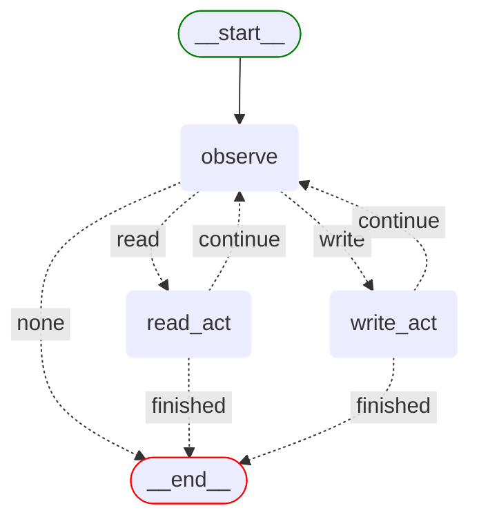

# fs_agent workflow

This directory contains the implementation of the File System Agent workflow.

## Directory structure

```
fs_agent/
├── workflow.py              # Main workflow definition
├── state.py                 # State management
├── state_types.py          # TypedDict state definitions
├── models/                  # Pydantic output models
├── nodes/                   # Node implementations
└── prompts/                 # Prompt templates
```

## Workflow overview

The fs_agent workflow implements a file system agent that can:

1. Determine operation mode (read-only vs write) on first interaction
2. List files in directories
3. Read file contents
4. Write to files (in write mode)
5. Delete files (in write mode)



**Note**: The observe node handles both mode detection (on first interaction) and action planning throughout the session.

## Key components

### [workflow.py](workflow.py)

Defines the simplified LangGraph workflow with conditional routing based on action types and completion status.

```python
# Simplified workflow - starts directly at observe
workflow.set_entry_point("observe")

# Conditional routing based on planned action
workflow.add_conditional_edges(
    "observe",
    determine_action_type,
    {
        "read": "read_act",     # Read operations
        "write": "write_act",   # Write operations  
        "none": END            # Task complete
    }
)
```

### [state.py](state.py) & [state_types.py](state_types.py)

Defines the `FSAgentState` TypedDict that tracks:
- Conversation messages
- Session configuration (working directory, read-only mode, completion status)
- Current action and results
- Action repetition tracking

### [nodes/](nodes/)

Contains the implementation of each node in the workflow:
- `observe.py`: Determines session mode (first interaction) and plans file actions based on conversation and previous results
- `read_act.py`: Executes read operations (list, read)
- `write_act.py`: Executes write operations (write, delete)
- `utils.py`: Helper functions for workflow control

### [prompts/](prompts/)

Contains prompt templates for the decision-making node:
- `observe_prompt.py`: Guides mode selection (first interaction) and action planning

### [models/](models/)

Contains Pydantic models for structured outputs:
- `observe_output.py`: Structured output for mode detection and action planning

## Workspace Directory

The agent operates within the `backend/workspace/` directory by default. This directory contains sample files and serves as the sandbox for file operations.

## Usage

The workflow is registered in the `WorkflowRegistry` and can be accessed through the API:

```python
workflow = WorkflowRegistry.get_workflow("fs-agent")
```

Through the OpenWebUI interface, select "fs-agent" from the model dropdown to interact with the file system agent.

## Example Interactions

### Read-only operations
```
User: "What files are in the workspace?"
Agent: [Lists files in workspace directory]

User: "Can you read the sample.txt file?"
Agent: [Reads and displays file contents]
```

### Write operations
```
User: "Create a new file called test.txt with some content"
Agent: [Creates the file with specified content]

User: "Delete the test.txt file"
Agent: [Deletes the specified file]
```

## Security Considerations

- The agent operates only within the designated workspace directory
- Path traversal attempts are prevented by path normalization
- Write operations require explicit user intent (detected by the router)
- File operations are logged for audit purposes