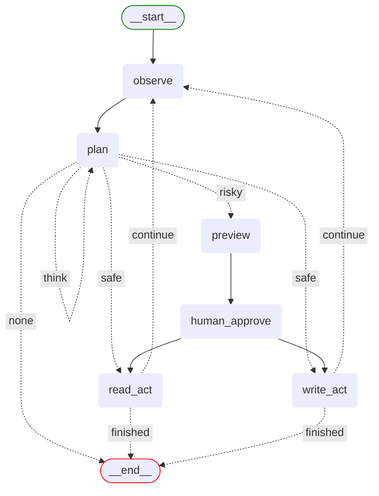

# fs_agent workflow

This directory contains the implementation of the File System Agent workflow.

## Directory structure

```
fs_agent/
├── workflow.py              # Main workflow definition
├── state.py                 # State management
├── state_types.py          # TypedDict state definitions
├── models/                  # Pydantic output models
├── nodes/                   # Node implementations
└── prompts/                 # Prompt templates
```

## Workflow overview

The fs_agent workflow implements a file system agent following the ReAct (Reasoning and Acting) pattern:

1. **Observe**: Gathers current state and context
2. **Plan**: Reasons about next action with optional thinking loops
3. **Approve**: For risky actions, generates preview and requires approval
4. **Act**: Executes the planned action (read or write operations)
5. **Loop**: Returns to observe for next iteration

The agent supports:
- Listing files in directories
- Reading file contents
- Writing to files (with preview and approval for risky operations)
- Editing files (with diff preview)
- Deleting files (with confirmation)



**Key Features**:
- **Think Loop**: The plan node can self-loop (max 2 iterations) for deeper reasoning
- **Safe vs Risky Actions**: Safe actions execute directly, risky actions require approval
- **Preview Generation**: For write/edit/delete operations, generates diffs for user review
- **Human-in-the-Loop**: Approval node for confirming risky operations

## Key components

### [workflow.py](workflow.py)

Defines the LangGraph workflow with conditional routing based on action safety and completion status.

```python
# Workflow starts at observe
workflow.set_entry_point("observe")

# Observe always goes to plan
workflow.add_edge("observe", "plan")

# Plan can self-loop (think) or route to safe/risky actions
workflow.add_conditional_edges(
    "plan",
    should_continue_planning,
    {
        "think": "plan",  # Self-loop for deeper thinking
        "safe": route_after_approval,  # Safe actions execute directly
        "risky": "preview",  # Risky actions need approval
        "none": END
    }
)
```

### [state.py](state.py) & [state_types.py](state_types.py)

Defines the `FSAgentState` TypedDict that tracks:
- Conversation messages
- Session configuration (working directory, read-only mode, completion status)
- Current action and results
- Action repetition tracking

### [nodes/](nodes/)

Contains the implementation of each node in the workflow:
- `observe.py`: Gathers current state and context from conversation history
- `plan.py`: Reasons about next action with optional thinking loops (max 2 iterations)
- `preview.py`: Generates diffs and previews for risky operations
- `human_approve.py`: Human-in-the-loop node for approving risky actions
- `read_act.py`: Executes read operations (list, read)
- `write_act.py`: Executes write operations (write, edit, delete)
- `utils.py`: Helper functions for workflow control and routing

### [prompts/](prompts/)

Contains prompt templates for the reasoning nodes:
- `observe_prompt.py`: Guides observation and context gathering
- `plan_prompt.py`: Guides action planning and thinking process

### [models/](models/)

Contains Pydantic models for structured outputs:
- `observe_output.py`: Structured output for observation results
- `plan_output.py`: Structured output for planning decisions and thinking

## Workspace directory

The agent operates within the `backend/workspace/` directory by default. This directory contains sample files and serves as the sandbox for file operations.

## Usage

The workflow is registered in the `WorkflowRegistry` and can be accessed through the API:

```python
workflow = WorkflowRegistry.get_workflow("fs-agent")
```

Through the OpenWebUI interface, select "fs-agent" from the model dropdown to interact with the file system agent.

## Example interactions

### Read operations (safe)
```
User: "What files are in the workspace?"
Agent: [Observes context] → [Plans list action] → [Executes list] → [Shows files]

User: "Can you read the index.html file?"
Agent: [Observes context] → [Plans read action] → [Reads and displays contents]
```

### Write operations (with approval)
```
User: "Create a new file called test.txt with 'Hello World' content"
Agent: [Observes] → [Plans write action] → [Generates preview] → 
       "I'll create test.txt with the following content: Hello World"
       [Awaits approval] → [Creates file after approval]

User: "Edit the test.txt file to say 'Hello Universe'"
Agent: [Observes] → [Plans edit] → [Shows diff preview] →
       "Preview of changes:
        - Hello World
        + Hello Universe"
       [Awaits approval] → [Applies edit after approval]

User: "Delete the test.txt file"
Agent: [Observes] → [Plans delete] → [Shows file to be deleted] →
       "I'll delete test.txt. This action cannot be undone."
       [Awaits approval] → [Deletes after approval]
```

### Planning with thinking
```
User: "I need to organize my project files better"
Agent: [Observes current structure] → [Plans with thinking loop] →
       "Let me think about the best approach..." →
       [Re-evaluates plan] → [Presents organized action plan] →
       [Executes approved actions]
```

## Security considerations

- The agent operates only within the designated workspace directory
- Path traversal attempts are prevented by path normalization
- Write operations require explicit user intent (detected by the router)
- File operations are logged for audit purposes