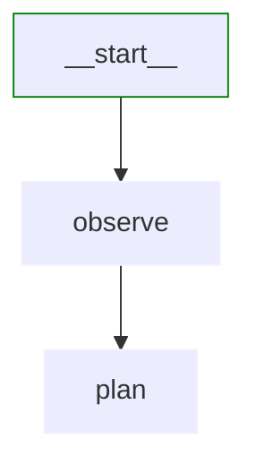
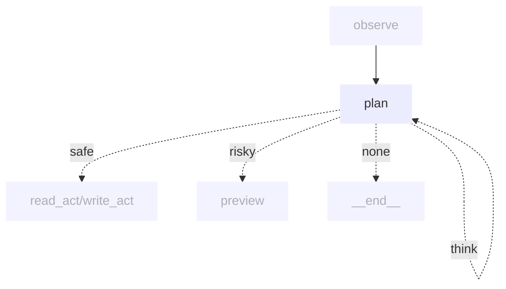
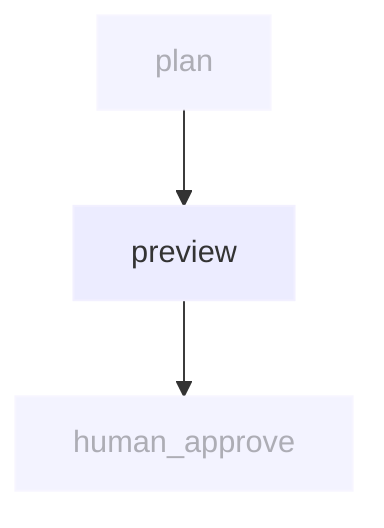
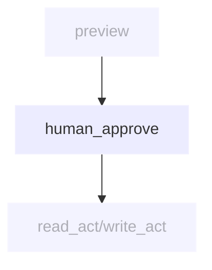
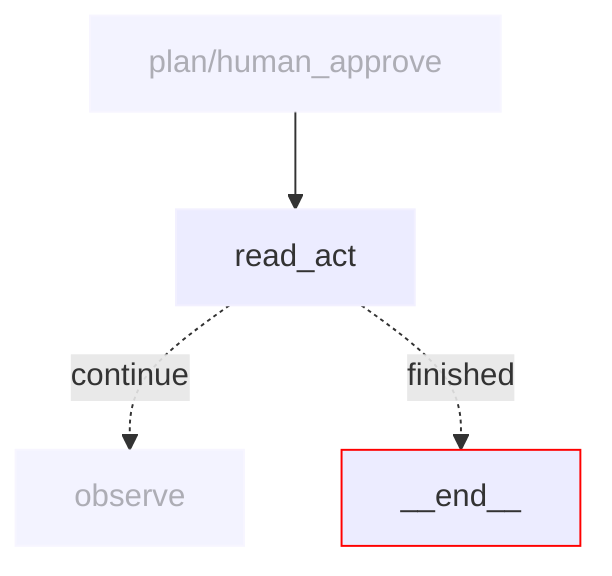

# fs_agent workflow nodes

This directory contains the implementation of each node in the File System Agent workflow.

## Node overview

Each node is implemented as an async function that takes a `FSAgentState` as input and returns an updated `FSAgentState`.

```python
async def node_name(state: FSAgentState) -> FSAgentState:
    # Process state and return updated state
    return state
```

## Node implementations

### [observe.py](observe.py)



Gathers context from the conversation history and prepares state for planning. This node analyzes the user's request and previous actions to understand the current situation.

**Reads from state:**
- `messages` - Conversation history
- `action_results` - Results from previous actions

**Updates state:**
- `current_observation` - Summary of current context
- `file_context` - Relevant file information

### [plan.py](plan.py)



Plans the next action based on observations. Implements **thinking loops** for complex reasoning and determines if actions are safe or risky.

**Reads from state:**
- `current_observation` - Context from observe node
- `messages` - User request
- `think_count` - Number of thinking iterations

**Updates state:**
- `action` - Planned action with details
- `action_safety` - Classification as safe/risky
- `think_count` - Incremented when thinking
- `reasoning` - Explanation of the plan

**Conditional routing:**
- `think` - Self-loop for deeper reasoning (max 2 iterations)
- `safe` - Direct execution for read/list operations
- `risky` - Preview required for write/edit/delete
- `none` - Task complete

### [preview.py](preview.py)



Generates previews and diffs for risky operations. Shows users exactly what will change before execution.

**Reads from state:**
- `action` - Planned action details
- `workspace_dir` - Target directory

**Updates state:**
- `preview` - Generated diff or preview
- `messages` - Updated with preview information

### [human_approve.py](human_approve.py)



Human-in-the-loop node that collects user approval for risky operations. Implements interrupt for user confirmation.

**Reads from state:**
- `preview` - Generated preview
- `action` - Action awaiting approval

**Updates state:**
- `messages` - Updated with user response
- `approval_status` - User's decision

### [read_act.py](read_act.py)



Executes read operations including listing directories and reading file contents.

**Reads from state:**
- `action` - Planned read/list action
- `workspace_dir` - Working directory

**Updates state:**
- `action_results` - Operation results
- `messages` - Updated with results
- `is_finished` - Completion status

**Supported operations:**
- `list` - List directory contents
- `read` - Read file contents

### [write_act.py](write_act.py)


Executes write operations including creating, editing, and deleting files.

**Reads from state:**
- `action` - Planned write/edit/delete action
- `workspace_dir` - Working directory
- `approval_status` - Confirmation for risky actions

**Updates state:**
- `action_results` - Operation results
- `messages` - Updated with results
- `is_finished` - Completion status

**Supported operations:**
- `write` - Create or overwrite file
- `edit` - Modify existing file
- `delete` - Remove file

### [utils.py](utils.py)

Contains helper functions for workflow control:

- `is_finished(state)` - Determines if workflow should end
- `route_after_approval(state)` - Routes to appropriate action node
- Path validation and sanitization functions

## State transformation patterns

All nodes follow these patterns:

1. **Immutable updates**: State is never mutated directly
2. **Error handling**: Graceful handling of file operations
3. **Logging**: Detailed logging for debugging
4. **Validation**: Input validation before operations
5. **Safety checks**: Path traversal prevention

## Action safety classification

Actions are classified as:

**Safe actions** (execute directly):
- List directory contents
- Read file contents

**Risky actions** (require approval):
- Write/create files
- Edit existing files
- Delete files

This classification ensures users maintain control over potentially destructive operations.