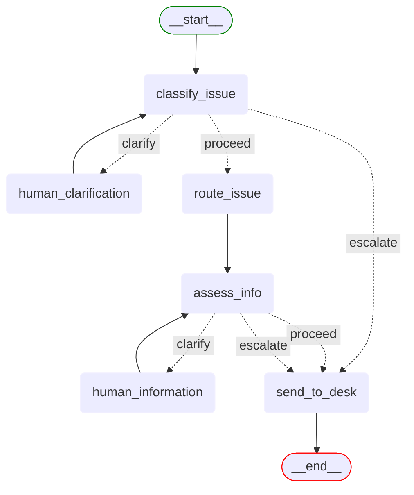

# Support desk workflow

This directory contains the implementation of the IT Support Desk workflow.

## Directory structure

```
support_desk/
├── workflow.py              # Main workflow definition
├── state.py                 # State management
├── data/                    # Evaluation data
├── examples/                # Example conversations
├── kb/                      # Knowledge base articles (domain context)
├── nodes/                   # Node implementations
└── prompts/                 # Prompt templates
```

## Workflow overview

The Support Desk workflow implements an IT support desk agent that:

1. Classifies issues into categories (with clarification loop when needed)
2. Routes issues to appropriate support teams (internal routing only)
3. Assesses information completeness and asks targeted questions
4. Creates support tickets with complete context



## Key components

### [workflow.py](workflow.py)

Defines the LangGraph workflow with conditional routing logic. Key feature is conditional edges that route based on analysis results.

```python
# Conditional edge example
workflow.add_conditional_edges(
    "classify_issue",
    should_continue_to_route,
    {
        "proceed": "route_issue",          # Classification complete
        "clarify": "human_clarification", # Need clarification
        "escalate": "send_to_desk"        # User requested escalation
    }
)
```

### [state.py](state.py)

Defines the `SupportDeskState` TypedDict that tracks conversation context, user information, and workflow progress.

### [nodes/](nodes/)

Contains the implementation of each node in the workflow:
- `classify_issue.py`: Categorises issues and generates clarifying questions when needed
- `human_clarification.py`: Lightweight interrupt node for collecting user clarifications
- `route_issue.py`: Internal routing logic that assigns issues to support teams
- `assess_info.py`: Assesses information completeness and generates targeted questions
- `human_information.py`: Lightweight interrupt node for collecting additional information
- `send_to_desk.py`: Creates tickets and formats final responses

### [prompts/](prompts/)

Contains prompt templates for each node, demonstrating effective prompt engineering techniques.

### [examples/](examples/)

Contains example conversations showing the workflow in action with different types of user inputs.

## Usage

The workflow is registered in the `WorkflowRegistry` and can be accessed through the API:

```python
workflow = WorkflowRegistry.get_workflow("support-desk")
```

The workflow follows the project convention with a `create_workflow()` function that returns the LangGraph workflow instance.
