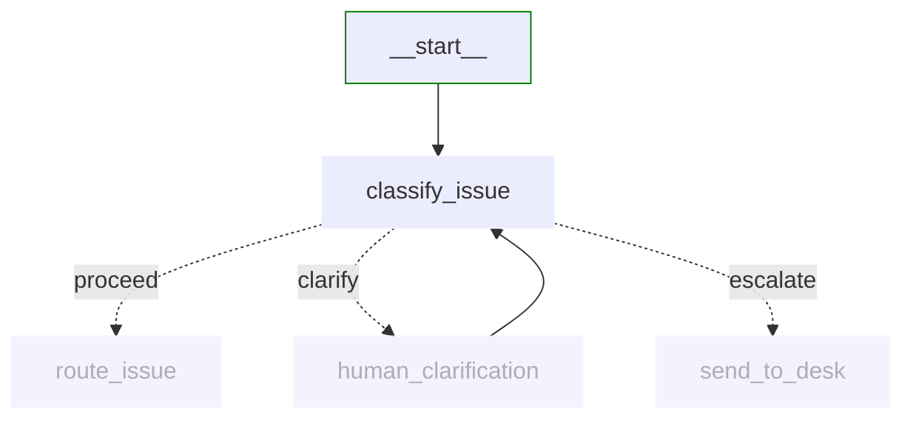
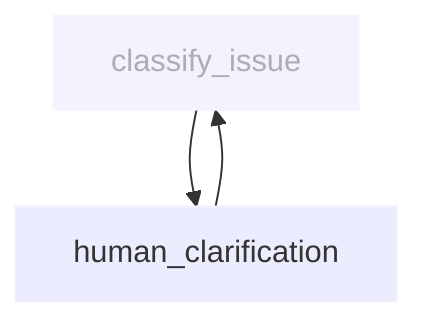
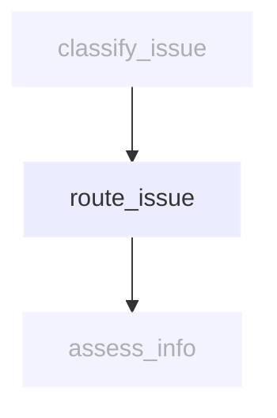
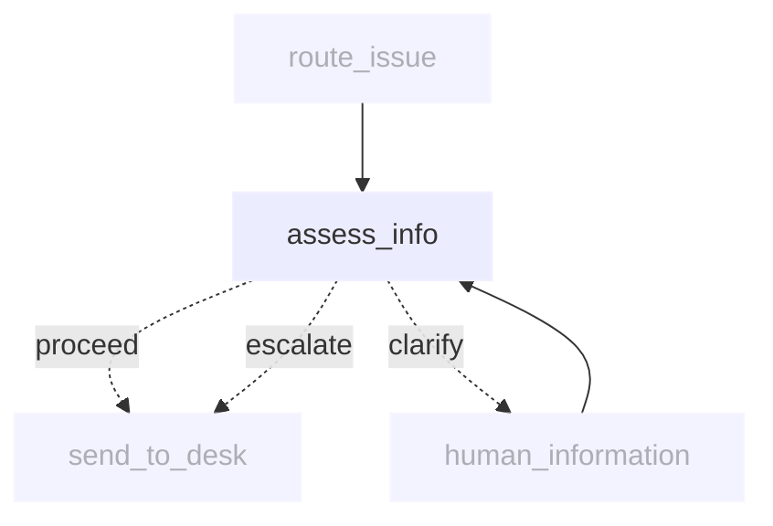
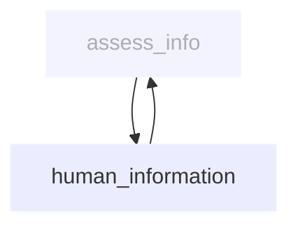
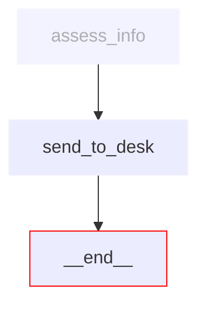

# Support desk workflow nodes

This directory contains the implementation of each node in the IT Support Desk workflow.

## Node overview

Each node is implemented as an async function that takes a `SupportDeskState` as input and returns an updated `SupportDeskState`.

```python
async def current_node(state: SupportDeskState) -> SupportDeskState:
    # Update state...
    return state
```

## Node implementations

### [classify_issue.py](classify_issue.py)



Categorises IT issues and generates clarifying questions when needed. This node implements **conditional routing** - it can proceed to routing, ask for clarification, or escalate based on the analysis.

**Reads from state:**
- `messages` - User conversation for classification
- `clarification_attempts` - How many questions have been asked

**Updates state:**
- `issue_category` - Assigned category (hardware, software, access, other)
- `issue_priority` - Priority level based on analysis
- `user_requested_escalation` - Whether user wants escalation
- `needs_clarification` - Whether more information is needed
- `messages` - Updated with clarifying questions when needed

### [human_clarification.py](human_clarification.py)



Lightweight interrupt node that collects user responses to clarifying questions. The questions are generated by classify_issue.

**Reads from state:**
- `clarification_attempts` - Current attempt count

**Updates state:**
- `messages` - Updated with user response
- `clarification_attempts` - Incremented after collection

### [route_issue.py](route_issue.py)



Internal routing node that assigns issues to appropriate support teams based on complexity. Operates silently without user-facing output.

**Reads from state:**
- `issue_category` - Category from classification
- `issue_priority` - Priority level
- `messages` - Context for routing decisions

**Updates state:**
- `assigned_team` - Team assignment (L1, L2, specialist, escalation)
- `estimated_resolution_time` - Expected timeframe
- `escalation_path` - Next level if needed

### [assess_info.py](assess_info.py)



Assesses information completeness and generates targeted questions when needed. Implements **conditional routing** - it can proceed to send, ask for clarification, or escalate based on analysis.

**Reads from state:**
- `issue_category` - Issue type for assessment criteria
- `messages` - Conversation for completeness analysis
- `gathering_round` - Current gathering attempt

**Updates state:**
- `needs_more_info` - Whether additional info is required
- `missing_categories` - Specific info categories needed
- `messages` - Updated with questions when needed

### [human_information.py](human_information.py)



Lightweight interrupt node that collects user responses to information gathering questions. Questions are generated by assess_info.

**Reads from state:**
- `gathering_round` - Current gathering attempt

**Updates state:**
- `messages` - Updated with user response
- `gathering_round` - Incremented after collection

### [send_to_desk.py](send_to_desk.py)



Creates support tickets and formats final responses with ticket information.

**Reads from state:**
- `issue_category` - Issue classification
- `assigned_team` - Team assignment from routing
- `issue_priority` - Priority level
- `messages` - Complete conversation context

**Updates state:**
- `ticket_id` - Generated unique identifier
- `ticket_status` - Initial status
- `current_response` - Final response with ticket details

## State transformation patterns

All nodes follow these state transformation patterns:

1. **Deep copy state**: Create a copy to avoid side effects
2. **Read required fields**: Extract specific state fields needed for processing
3. **Transform data**: Use LLM to process inputs and generate outputs
4. **Update state fields**: Store results in specific state fields
5. **Handle errors**: Gracefully manage exceptions without corrupting state

Each node acts as a pure function: `(state) -> updated_state`, making the workflow predictable and debuggable.
