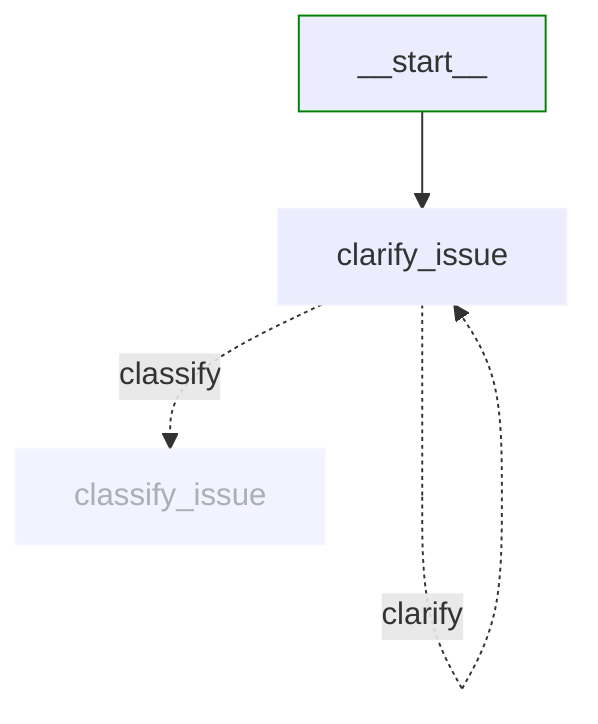
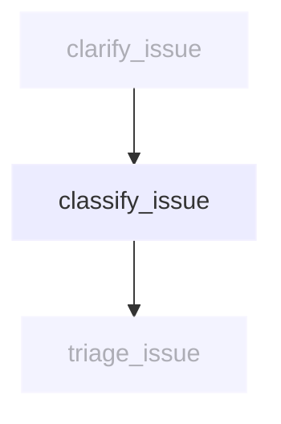
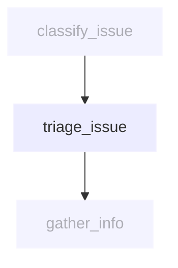
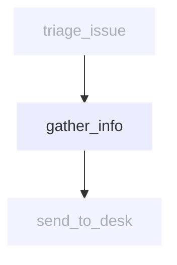
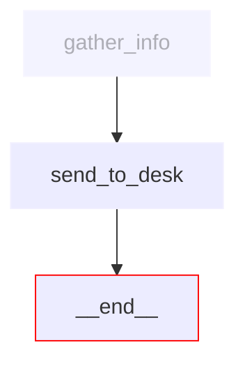

# Support desk workflow nodes

This directory contains the implementation of each node in the IT Support Desk workflow.

## Node overview

Each node is implemented as an async function that takes a `SupportDeskState` as input and returns an updated `SupportDeskState`.

```python
async def current_node(state: SupportDeskState) -> SupportDeskState:
    state = deepcopy(state)
    # Update state...
    return state
```

## Node implementations

### [clarify_issue.py](clarify_issue.py)



Analyses user input and asks clarifying questions when needed. This node implements a **conditional loop** - the dotted lines show that based on the analysis, it can either loop back to itself for more clarification or proceed to classification.

**Reads from state:**
- `current_user_input` - The user's message to analyze for clarity
- `messages` - Previous conversation context
- `clarification_attempts` - How many questions have been asked
- `max_clarification_attempts` - Maximum questions allowed

**Updates state:**
- `needs_clarification` - Whether more information is needed
- `clarification_attempts` - Incremented when asking questions
- `current_response` - Clarifying question or confirmation to proceed
- `messages` - Updated with the agent's response

### [classify_issue.py](classify_issue.py)



Categorises the IT issue into one of the predefined categories: [`hardware, software, access, network, other`](../models/classify_output.py#L19).

**Reads from state:**
- `current_user_input` - The issue description to classify
- `messages` - Full conversation context for better classification

**Updates state:**
- `issue_category` - Assigned category ([`hardware, software, access, network, other`](../models/classify_output.py#L19))
- `issue_priority` - Priority level based on urgency keywords ([`P1, P2, P3`](../models/classify_output.py#L23))
- `current_response` - Classification summary for the user

### [triage_issue.py](triage_issue.py)



Internal routing node that assigns issues to the appropriate support team based on complexity and context. This node operates silently without user-facing output.

**Reads from state:**
- `issue_category` - Category determined by classification
- `issue_priority` - Priority level for routing decisions
- `messages` - Full conversation context for nuanced routing decisions

**Updates state:**
- `support_team` - Assigned team ([`L1, L2, specialist, escalation`](../models/triage_output.py#L14))
- `estimated_resolution_time` - Expected timeframe based on issue complexity
- `escalation_path` - Next level if current team cannot resolve

**Note:** This is an internal processing node. No user-facing messages are generated here.

### [gather_info.py](gather_info.py)



Collects additional information needed for the support team to resolve the issue.

**Reads from state:**
- `issue_category` - Type of issue to determine required information
- `support_team` - Target team to tailor information gathering
- `messages` - Conversation history to extract details
- `user_context` - User information for ticket context

**Updates state:**
- `ticket_info` - Comprehensive ticket details and metadata
- `current_response` - Information gathering summary

### [send_to_desk.py](send_to_desk.py)



Creates a support ticket and formats the final response with ticket information.

**Reads from state:**
- `ticket_info` - Complete ticket details from previous nodes
- `support_team` - Team assignment for ticket routing
- `issue_priority` - Priority for ticket metadata

**Updates state:**
- `ticket_id` - Generated unique ticket identifier
- `ticket_status` - Initial ticket status (e.g., "created", "assigned")
- `current_response` - Final response with ticket details and next steps

## State transformation patterns

All nodes follow these state transformation patterns:

1. **Deep copy state**: Create a copy to avoid side effects
2. **Read required fields**: Extract specific state fields needed for processing
3. **Transform data**: Use LLM to process inputs and generate outputs
4. **Update state fields**: Store results in specific state fields
5. **Handle errors**: Gracefully manage exceptions without corrupting state

Each node acts as a pure function: `(state) -> updated_state`, making the workflow predictable and debuggable.
