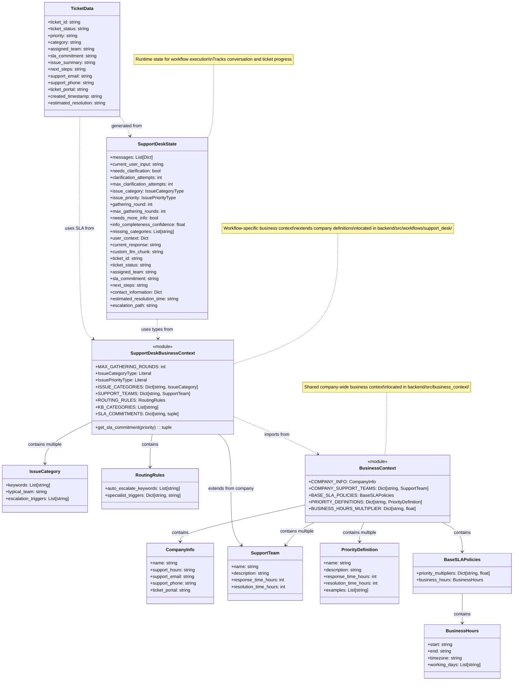

# Business Context UML Diagram

This diagram shows the data model for our business context architecture using the hybrid approach.

## Key Components

### Company-wide Business Context (Shared)
- **CompanyInfo**: Basic company information (name, support hours, contact details)
- **SupportTeam**: Team definitions with SLA response and resolution times
- **PriorityDefinition**: Priority levels (P1-P4) with descriptions and examples
- **BaseSLAPolicies**: Company-wide SLA policies including business hours and priority multipliers

### Support Desk Workflow Context (Specific)
- Extends company definitions with workflow-specific rules
- **IssueCategory**: Categories (hardware, software, access, network, other) with keywords and routing rules
- **RoutingRules**: Auto-escalation keywords and specialist triggers
- Imports and extends company support teams
- Provides `get_sla_commitment()` function that derives SLAs from company policies

### Runtime Data
- **SupportDeskState**: The workflow state that tracks conversation progress and ticket details
- **TicketData**: Final ticket output generated from state with all necessary information

## Relationships
- Solid arrows (→) indicate composition/containment
- Dashed arrows (..>) indicate usage/dependency
- The diagram illustrates the hybrid approach where shared business context is imported and extended by workflow-specific contexts