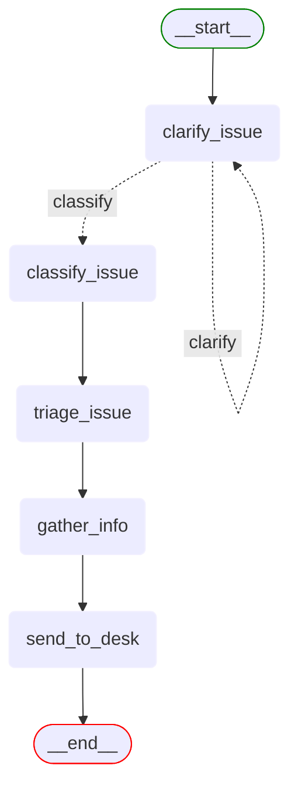

# Support desk workflow

This directory contains the implementation of the IT Support Desk workflow.

## Directory structure

```
support_desk/
├── workflow.py              # Main workflow definition
├── state.py                 # State management
├── data/                    # Evaluation data
├── examples/                # Example conversations
├── kb/                      # Knowledge base articles (domain context)
├── nodes/                   # Node implementations
└── prompts/                 # Prompt templates
```

## Workflow overview

The Support Desk workflow implements an IT support desk agent that:

1. Clarifies user issues when needed (with conditional loop)
2. Classifies issues into categories
3. Triages issues to appropriate support teams (internal routing only)
4. Gathers additional information through targeted questions
5. Creates support tickets with complete context



## Key components

### [workflow.py](workflow.py)

Defines the LangGraph workflow with conditional loop logic. The key feature is the conditional edge from the `clarify_issue` node that can either loop back to itself or proceed to the `classify_issue` node based on the state.

```python
# Conditional edge example
workflow.add_conditional_edges(
    "clarify_issue",
    should_continue_clarifying,
    {
        "clarify": "clarify_issue",  # Loop back to clarify
        "classify": "classify_issue"  # Proceed to classification
    }
)
```

### [state.py](state.py)

Defines the `SupportDeskState` TypedDict that tracks conversation context, user information, and workflow progress.

### [nodes/](nodes/)

Contains the implementation of each node in the workflow:
- `clarify_issue.py`: Analyses user input and asks clarifying questions
- `classify_issue.py`: Categorises issues into predefined types
- `triage_issue.py`: Internal routing logic that assigns issues to support teams based on complexity
- `gather_info.py`: Collects additional information through targeted user questions
- `send_to_desk.py`: Creates tickets and formats final responses

### [prompts/](prompts/)

Contains prompt templates for each node, demonstrating effective prompt engineering techniques.

### [examples/](examples/)

Contains example conversations showing the workflow in action with different types of user inputs.

## Usage

The workflow is registered in the `WorkflowRegistry` and can be accessed through the API:

```python
workflow = WorkflowRegistry.get_workflow("support-desk")
```

The workflow follows the project convention with a `create_workflow()` function that returns the LangGraph workflow instance.
