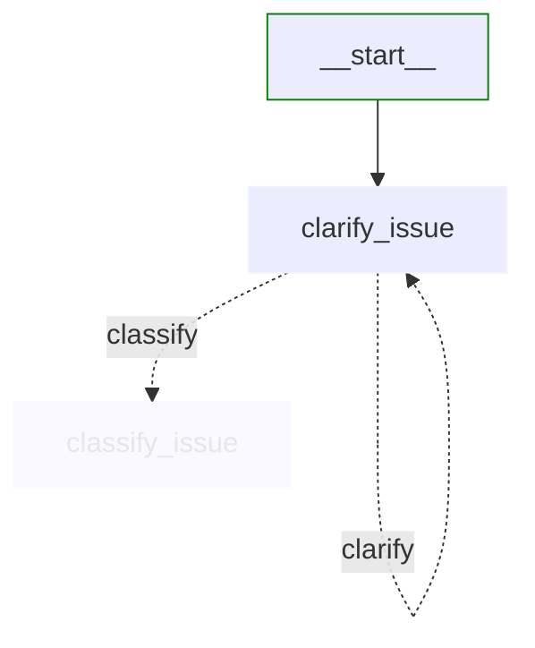
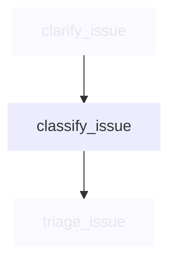
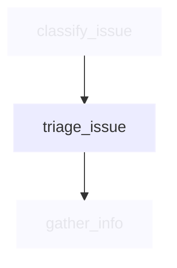
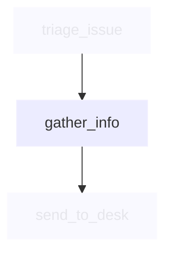
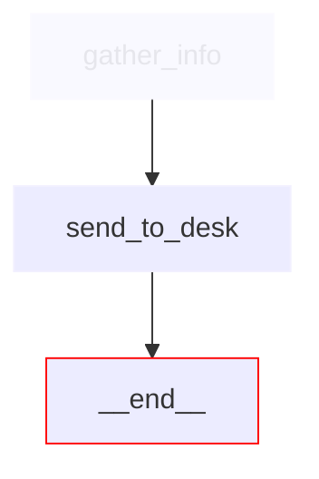

# Support desk workflow nodes

This directory contains the implementation of each node in the IT Service Desk workflow.

## Node overview

Each node is implemented as an async function that takes a `SupportDeskState` as input and returns an updated `SupportDeskState`.

```python
async def some_node(state: SupportDeskState) -> SupportDeskState:
    state = deepcopy(state)
    # Process state...
    return state
```

## Node implementations

### [clarify_issue.py](clarify_issue.py)



Analyses user input and asks clarifying questions when needed. This node implements a **conditional loop** - the dotted lines show that based on the analysis, it can either loop back to itself for more clarification or proceed to classification.

**Key features:**
- Analyses input clarity using LLM
- Generates clarifying questions when needed
- Tracks clarification attempts
- Updates state to control workflow path

### [classify_issue.py](classify_issue.py)



Categorises the IT issue into one of the predefined categories: hardware, software, access, or other.

**Key features:**
- Uses LLM to analyse issue description
- Assigns category and confidence level
- Sets priority based on impact

### [triage_issue.py](triage_issue.py)



Routes the issue to the appropriate support team based on the category and priority.

**Key features:**
- Determines support team based on category
- Considers priority for escalation
- Sets expected response time

### [gather_info.py](gather_info.py)



Collects additional information needed for the support team to resolve the issue.

**Key features:**
- Determines what information is needed
- Creates comprehensive ticket details
- Formats information for support team

### [send_to_desk.py](send_to_desk.py)



Creates a support ticket and formats the final response with ticket information.

**Key features:**
- Generates ticket ID
- Creates professional response
- Provides next steps and expectations

## Common patterns

All nodes follow these common patterns:

1. **Deep Copy State**: Create a copy to avoid side effects
2. **Extract Context**: Get relevant information from state
3. **Process with LLM**: Use prompts to generate responses
4. **Update State**: Store results in the state
5. **Handle Errors**: Gracefully manage exceptions

## Educational focus

These nodes demonstrate:
- Effective prompt engineering
- State management in LangGraph
- Error handling in AI workflows
- Streaming responses for interactivity