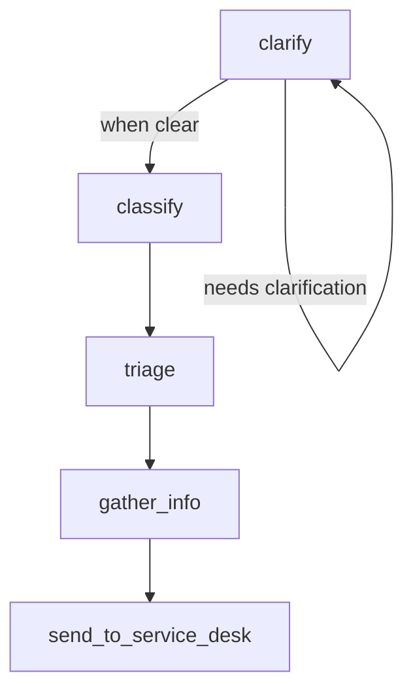

# IT Service Desk with Conditional Loop Pedagogy - Architecture Document

## Overview

This document outlines the architecture for the IT Service Desk workflow with Conditional Loop Pedagogy. The system is designed as an educational tool with two learning phases:

1. **Phase 1**: Linear workflow - 5 nodes, prompt engineering focus
2. **Phase 2**: Add conditional loop - LangGraph conditional logic focus

The implementation will replace the existing HelpHub workflow entirely.

## System Architecture

### Business Topology



### Directory Structure

```
src/workflows/support_desk/
├── __init__.py              # Package initialization
├── workflow.py              # LangGraph workflow definition with conditional logic
├── state.py                 # State management
├── nodes/                   # Node implementations
│   ├── __init__.py
│   ├── clarify_issue.py     # Implementation with conditional loop logic
│   ├── classify_issue.py    # Implementation for categorization
│   ├── triage_issue.py      # Implementation for routing
│   ├── gather_info.py       # Implementation for information collection
│   └── send_to_desk.py      # Implementation for service desk handoff
├── prompts/                 # Prompt templates
│   ├── __init__.py
│   ├── clarify_issue_prompt.py
│   ├── classify_issue_prompt.py
│   ├── triage_issue_prompt.py
│   ├── gather_info_prompt.py
│   └── send_to_desk_prompt.py
└── examples/                # Example conversations
    ├── linear_flow.json
    └── conditional_flow.json
```

## State Management

The `state.py` file will define a `SupportDeskState` TypedDict with the following structure:

```python
class SupportDeskState(TypedDict):
    # Core conversation data
    messages: List[Dict[str, str]]  # Chat messages in OpenAI format
    current_user_input: str         # Latest user message
    
    # Workflow tracking
    needs_clarification: bool       # Whether more info is needed
    clarification_attempts: int     # Number of questions asked
    max_clarification_attempts: int # Limit on questions
    
    # Issue information (populated during workflow)
    issue_category: Optional[str]   # hardware, software, access, other
    issue_priority: Optional[str]   # high, medium, low
    support_team: Optional[str]     # L1 support, specialist, escalation
    ticket_info: Dict[str, Any]     # Complete ticket information
    
    # Response data
    current_response: str           # Response being built
    custom_llm_chunk: Optional[str] # For streaming
```

## Node Implementations

### 1. clarify_issue

**Purpose**: Analyze user input and generate clarifying questions when needed.

**Implementation**:
- Analyze user input for clarity and completeness
- Determine if enough information exists to proceed
- Generate clarifying questions if needed
- Track clarification attempts
- Implement conditional loop logic

**Conditional Logic**:
```python
def should_continue_clarifying(state) -> str:
    """Predicate function for conditional edge"""
    if state.get("needs_clarification", False):
        return "clarify"  # Loop back to clarify
    else:
        return "classify"  # Proceed to classification
```

### 2. classify_issue

**Purpose**: Categorize the IT issue into predefined categories.

**Implementation**:
- Analyze the user's issue description
- Categorize into: hardware, software, access, other
- Set confidence levels
- Update the workflow state with category information

### 3. triage_issue

**Purpose**: Route the issue to the appropriate support team.

**Implementation**:
- Determine the appropriate support team based on category
- Route to: L1 support, specialist, escalation
- Update the workflow state with routing information

### 4. gather_additional_info

**Purpose**: Collect additional information needed for the support team.

**Implementation**:
- Collect user details, context, urgency
- Determine what information the support team needs
- Update the workflow state with complete ticket information

### 5. send_to_service_desk

**Purpose**: Format the final response with ticket information.

**Implementation**:
- Format final response with ticket ID and next steps
- Create professional handoff message
- Provide user confirmation and tracking info

## Workflow Implementation

The `workflow.py` file will implement the LangGraph workflow with conditional logic:

```python
def create_support_desk_workflow():
    """Create the Support Desk LangGraph workflow with conditional loop."""
    
    # Create the workflow graph
    workflow = StateGraph(SupportDeskState)
    
    # Add nodes to the workflow
    workflow.add_node("clarify_issue", clarify_issue_node)
    workflow.add_node("classify_issue", classify_issue_node)
    workflow.add_node("triage_issue", triage_issue_node)
    workflow.add_node("gather_info", gather_info_node)
    workflow.add_node("send_to_desk", send_to_desk_node)
    
    # Set entry point
    workflow.set_entry_point("clarify_issue")
    
    # Add conditional edge for clarification loop
    workflow.add_conditional_edges(
        "clarify_issue",
        should_continue_clarifying,
        {
            "clarify": "clarify_issue",  # Loop back to clarify
            "classify": "classify_issue"  # Proceed to classification
        }
    )
    
    # Add remaining edges
    workflow.add_edge("classify_issue", "triage_issue")
    workflow.add_edge("triage_issue", "gather_info")
    workflow.add_edge("gather_info", "send_to_desk")
    workflow.add_edge("send_to_desk", END)
    
    # Compile the workflow
    compiled_workflow = workflow.compile()
    
    return compiled_workflow
```

## Prompt Engineering

Each node will have a corresponding prompt file in the `prompts/` directory. The prompts will focus on:

### clarify_issue_prompt.py

- Analysis prompt to determine if input needs clarification
- Clarification prompt to generate specific questions
- Focus on "When is input clear enough to proceed?"

### classify_issue_prompt.py

- Classification prompt to categorize issues
- Focus on "Extract issue type and priority from description"
- Categories: hardware, software, access, other

### triage_issue_prompt.py

- Routing logic prompt
- Focus on "Match category to appropriate support team"
- Support teams: L1 support, specialist, escalation

### gather_info_prompt.py

- Information collection prompt
- Focus on "What info does the support team need?"
- Collect user details, context, urgency

### send_to_desk_prompt.py

- Response formatting prompt
- Focus on "Create professional handoff message"
- Format with ticket ID and next steps

## Integration with Existing System

### Registry Updates

The `registry.py` file will be updated to use the new support_desk workflow:

```python
# Replace HelpHub with Support Desk
if name == "support_desk":
    from .support_desk.workflow import create_support_desk_workflow
    workflow = create_support_desk_workflow()
    cls.register_workflow(name, lambda: workflow)
    return workflow
```

### API Updates

The `api.py` file will be updated to reference the new workflow:

```python
# Initialize Support Desk workflow state
state = create_initial_state()
workflow = WorkflowRegistry.get_workflow("support_desk")
```

## Learning Outcomes

### Phase 1 (Linear)

- Prompt engineering for business workflows
- State management in conversations
- Professional response generation
- Business logic through prompts

### Phase 2 (Conditional)

- LangGraph conditional edges
- Predicate function patterns
- Loop control and state management
- Advanced workflow design

## Implementation Complexity Guidelines

### Simple Conditional Logic

- Basic if/else decisions
- String matching for categories
- Simple confidence thresholds
- No complex algorithms

### No External APIs

- Mock service desk responses
- Simulated ticket creation
- Local state only
- No real integrations

### Prompt Engineering Focus

- Business logic through prompts
- LangGraph scaffolding provided
- Clear success criteria for each prompt
- Immediate testing feedback