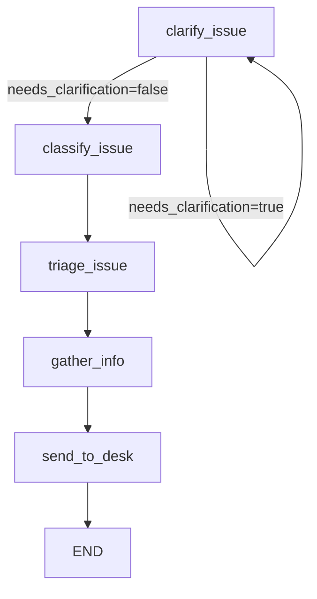

# Workflow Design with Conditional Loop Logic

## Overview

This document provides a detailed design for the workflow implementation of the IT Service Desk, focusing on the conditional loop logic that is central to Phase 2 of the learning progression. The workflow will be implemented using LangGraph, a framework for building stateful, multi-step AI workflows.

## Workflow Structure

The IT Service Desk workflow follows this structure:



The key feature is the conditional loop at the `clarify_issue` node, which can either loop back to itself or proceed to the `classify_issue` node based on the state of the conversation.

## Implementation in LangGraph

The workflow will be implemented in `src/workflows/support_desk/workflow.py` using LangGraph's `StateGraph` and conditional edges:

```python
"""
Support Desk LangGraph workflow definition with conditional loop logic.

This module implements the IT Service Desk workflow with a conditional
clarification loop, demonstrating advanced LangGraph patterns.
"""
import logging
from typing import Literal
from langgraph.graph import StateGraph, END
from langgraph.prebuilt import ToolNode

from .state import SupportDeskState, create_initial_state
from .nodes import (
    clarify_issue_node,
    classify_issue_node,
    triage_issue_node,
    gather_info_node,
    send_to_desk_node
)

logger = logging.getLogger(__name__)


def should_continue_clarifying(state: SupportDeskState) -> Literal["clarify", "classify"]:
    """
    Predicate function for conditional edge from clarify_issue node.
    
    This function determines whether to:
    1. Loop back to clarify_issue for more information (when needs_clarification=True)
    2. Proceed to classify_issue when we have enough information (needs_clarification=False)
    
    Args:
        state: Current workflow state
        
    Returns:
        "clarify" to loop back for more clarification
        "classify" to proceed to classification
    """
    if state.get("needs_clarification", False):
        logger.info("Need more clarification, looping back to clarify_issue")
        return "clarify"
    else:
        logger.info("Have enough information, proceeding to classify_issue")
        return "classify"


def create_support_desk_workflow():
    """
    Create the Support Desk LangGraph workflow with conditional loop.
    
    This workflow implements an IT support agent flow with a conditional clarification loop:
    
    Phase 1 (Linear Flow):
    clarify_issue → classify_issue → triage_issue → gather_info → send_to_desk
    
    Phase 2 (Conditional Loop):
    clarify_issue ⟲ (stays in clarify until clear) → classify_issue → triage_issue → gather_info → send_to_desk
    
    The conditional loop demonstrates how to implement stateful, multi-turn conversations
    that can adapt based on the quality and completeness of user input.
    """
    
    logger.info("Creating Support Desk workflow")
    
    # Create the workflow graph
    workflow = StateGraph(SupportDeskState)
    
    # Add nodes to the workflow
    workflow.add_node("clarify_issue", clarify_issue_node)
    workflow.add_node("classify_issue", classify_issue_node)
    workflow.add_node("triage_issue", triage_issue_node)
    workflow.add_node("gather_info", gather_info_node)
    workflow.add_node("send_to_desk", send_to_desk_node)
    
    # Set entry point
    workflow.set_entry_point("clarify_issue")
    
    # Add conditional edge for clarification loop
    workflow.add_conditional_edges(
        "clarify_issue",
        should_continue_clarifying,
        {
            "clarify": "clarify_issue",  # Loop back to clarify
            "classify": "classify_issue"  # Proceed to classification
        }
    )
    
    # Add remaining edges for linear flow
    workflow.add_edge("classify_issue", "triage_issue")
    workflow.add_edge("triage_issue", "gather_info")
    workflow.add_edge("gather_info", "send_to_desk")
    workflow.add_edge("send_to_desk", END)
    
    # Compile the workflow
    compiled_workflow = workflow.compile()
    
    logger.info("Support Desk workflow compiled successfully")
    return compiled_workflow
```

## Conditional Logic Explanation

The key to implementing the conditional loop is the `should_continue_clarifying` predicate function and the `add_conditional_edges` method:

### Predicate Function

```python
def should_continue_clarifying(state: SupportDeskState) -> Literal["clarify", "classify"]:
    if state.get("needs_clarification", False):
        return "clarify"  # Loop back to clarify
    else:
        return "classify"  # Proceed to classification
```

This function:
1. Examines the current state
2. Checks the `needs_clarification` flag
3. Returns a string literal that determines the next node

### Conditional Edge

```python
workflow.add_conditional_edges(
    "clarify_issue",
    should_continue_clarifying,
    {
        "clarify": "clarify_issue",  # Loop back to clarify
        "classify": "classify_issue"  # Proceed to classification
    }
)
```

This method:
1. Specifies the source node (`"clarify_issue"`)
2. Provides the predicate function that determines the next node
3. Maps the predicate function's return values to destination nodes

## Phase 1 vs Phase 2 Explanation

The workflow implementation includes detailed comments explaining how it represents both Phase 1 and Phase 2 of the learning progression:

```python
"""
Phase 1 (Linear Flow):
clarify_issue → classify_issue → triage_issue → gather_info → send_to_desk

Phase 2 (Conditional Loop):
clarify_issue ⟲ (stays in clarify until clear) → classify_issue → triage_issue → gather_info → send_to_desk
"""
```

This helps students understand how the conditional loop extends the basic linear flow.

## State Management in the Workflow

The workflow uses the `SupportDeskState` TypedDict to manage state throughout the execution:

```python
# Create the workflow graph
workflow = StateGraph(SupportDeskState)
```

This ensures that:
1. All nodes operate on the same state structure
2. State transitions are tracked properly
3. The conditional logic has access to the necessary state information

## Execution Flow

When the workflow is executed:

1. It starts at the `clarify_issue` node
2. The node processes the user input and updates the state
3. The `should_continue_clarifying` function examines the state
4. Based on the return value, the workflow either:
   - Loops back to `clarify_issue` for more information
   - Proceeds to `classify_issue` when enough information is available
5. The remaining nodes execute in sequence
6. The workflow ends after the `send_to_desk` node

## Preventing Infinite Loops

To prevent infinite loops, the `clarify_issue` node tracks the number of clarification attempts:

```python
clarification_attempts = state.get("clarification_attempts", 0)
max_attempts = state.get("max_clarification_attempts", 3)

# Later in the code:
needs_clarification = (
    "needs clarification" in analysis_content or
    "clarification needed" in analysis_content or
    "more information" in analysis_content
) and clarification_attempts < max_attempts
```

This ensures that after a certain number of attempts, the workflow will proceed even if the information is incomplete.

## Educational Value

This workflow design demonstrates several important LangGraph concepts:

1. **Conditional Edges**: How to create branches in the workflow based on state
2. **Predicate Functions**: How to examine state to determine the next node
3. **Loop Prevention**: How to prevent infinite loops in conversational workflows
4. **State Management**: How to track and update state throughout the workflow
5. **Node Composition**: How to compose multiple nodes into a coherent workflow

Students will learn:
- How to implement stateful, multi-turn conversations
- How to use conditional logic to create adaptive workflows
- How to design predicate functions for workflow control
- How to prevent common issues like infinite loops

## Implementation Notes

The workflow will be implemented in `src/workflows/support_desk/workflow.py` and will include:

1. Import statements for required modules
2. The `should_continue_clarifying` predicate function
3. The `create_support_desk_workflow` function
4. Detailed comments explaining the workflow structure and logic

This implementation provides a solid foundation for the IT Service Desk while remaining simple enough for educational purposes.